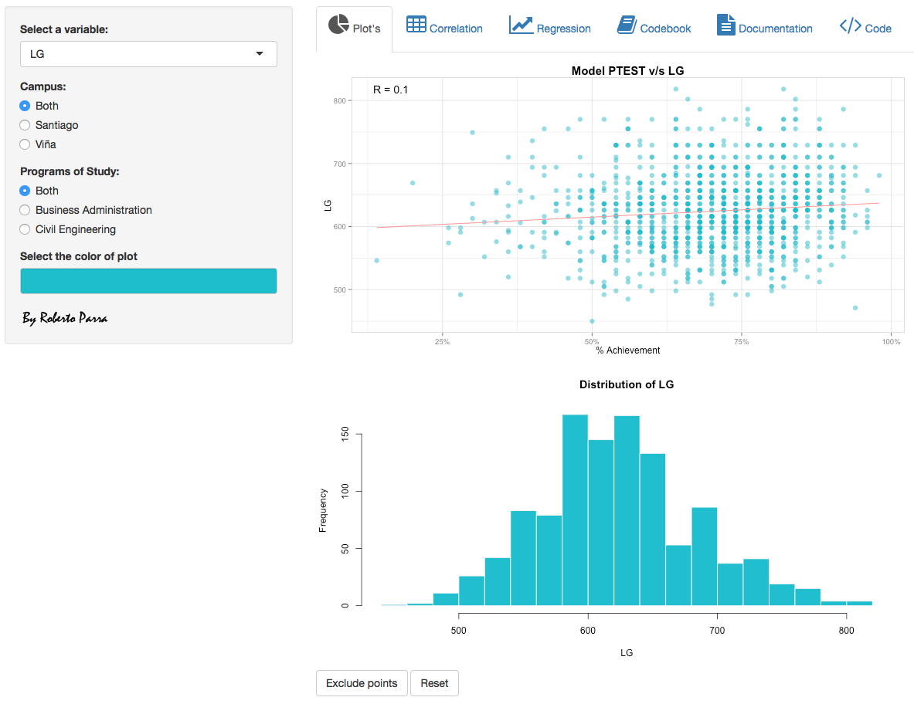
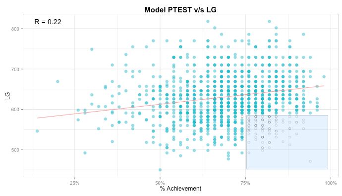
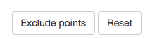
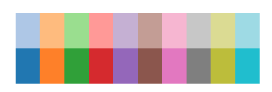
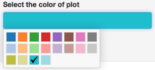
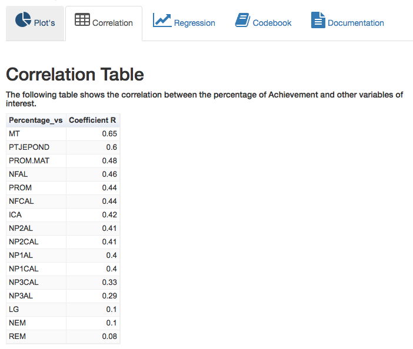
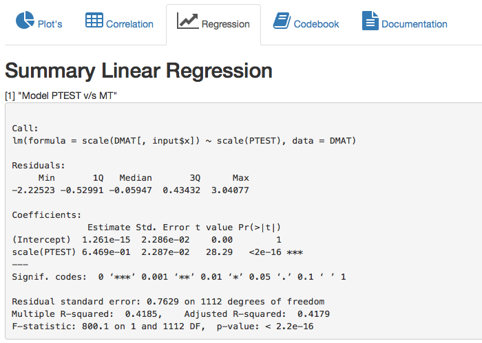
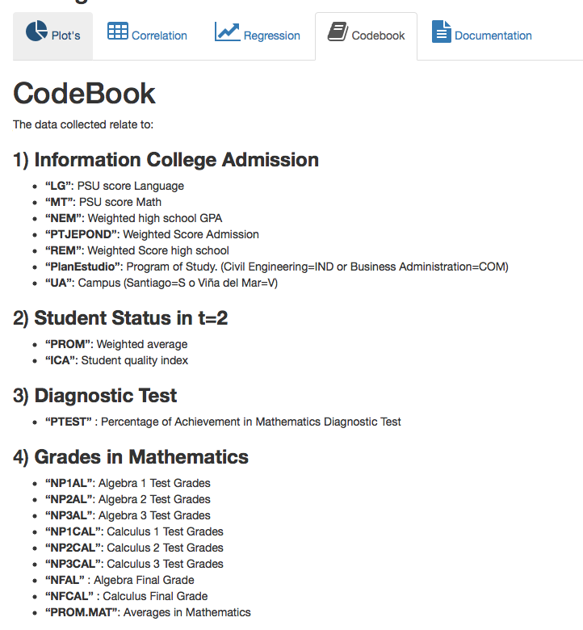

Esta aplicación sirve para el análisis exploratorio del resultado del Test Diagnóstico de Matemáticas respecto de variables que tradicionalmente se manejan en las Universidades.
La idea es poder evaluar el poder predictivo de esta nueva variable **PTEST**.

## Plot's

La pantalla inicial muestra dos gráficos:

- un **scatterplot** del **Percentage Achievement (PTEST)** v/s **PSU Score Language (LG)** 
- un **histograma** de la variable **LG**.

Desde esta pantalla se puede seleccionar cualquier otra variable incluida en el estudio (16) además de subdividir la muestra desde los checkbox:

- **Campus** (Santiago or Viña)
- **Programs** of Study (Business Administration or Civil Engineering)

En la siguiente figura se aprecia lo descrito.



Además puede seleccionar un punto o un grupo de puntos para excluirlos del modelo y ver rápidamente como cambian las estimaciones y el coeficiente de Correlación.

Para eso siga los siguientes pasos:

1. Seleccione un punto o un grupo de ellos 



2. Presione el botón **Exclude Points** 


En la pantalla inicial tambien podrá seleccionar el color de los gráficos usando mi paleta personalizada de 20 colores, gracias al uso del paquete **shinyjs**




## Correlation

En esta pestaña podrá visualizar las correlaciones de todas las variables incluidas v/s PTEST (Porcentaje de Logro). Las correlaciones se encuentran ordenadas de menor a mayor.


## Regression

En esta pestaña se muestra el resultado del regresión lineal de la variable seleccionada respecto de la variable independiente **PTEST**



## Codebook

Acá encontrará la descripción de las variables incluidas en esta aplicación.



## Code

Para desarrollar esta aplicación se escribió todo el código en un archivo app.R que contiene al ui.R y server.R encuentro que es una forma más comoda de trabajar.

El código UI es el siguiente:
```{r,eval=F}
DMAT<-read.csv("./data/DATAMAT.csv",header=TRUE,sep=";",dec=",") 
DMAT<-DMAT[complete.cases(DMAT),]
library(ggplot2)
library(grid)
library(gridExtra)
library(scales)
library(shiny)
library(googleVis)
library(shinyjs)

shinyUI(
        fluidPage(titlePanel("Math Diagnostic Test",windowTitle = "DMAT"),
                     h2("Exploratory analysis of Percentage Achievement", align = "left"),
                     sidebarLayout(sidebarPanel(
                             selectInput('x','Select a variable:',
                                         choice=names(DMAT[-c(8,18,19)])),
                             radioButtons("campus","Campus:",c("Both" = "both", "Santiago" = "S", "Viña" = "V")),
                             radioButtons("programs","Programs of Study:",c("Both" = "both", "Business Administration" = "COM", "Civil Engineering" = "IND")),
                             colourInput("col", "Select the color of plot",
                                         value="#17BECF",showColour="background",
                                         palette = "limited",
                                         allowedCols=c("#1F77B4","#FF7F0E","#2CA02C","#D62728","#9467BD",
                                                       "#8C564B","#E377C2","#7F7F7F","#AEC7E8","#FFBB78",
                                                       "#98DF8A","#FF9896","#C5B0D5","#C49C94","#F7B6D2",
                                                       "#C7C7C7","#BCBD22","#DBDB8D","#17BECF","#9EDAE5")),
                             img(src="Firma.png", height = 30, width = 117.6)),
                             mainPanel(tabsetPanel(type = "tabs",
                                                   tabPanel(p(icon("pie-chart","fa-2x"),"Plot's"),
                                                            textOutput("text2"),
                                                            plotOutput('regPlot',
                                                                       click = "plot_click",
                                                                       brush = brushOpts(id = "plot_brush")),
                                                            plotOutput("distPlot"),
                                                            actionButton("exclude_points", "Exclude points"),
                                                            actionButton("exclude_reset", "Reset")),
                                                   tabPanel(p(icon("table","fa-2x"),"Correlation"),
                                                            br(),h2("Correlation Table"),
h5("The following table shows the correlation between the percentage of Achievement and other variables of interest."),
                                                htmlOutput("corr"),
                                                HTML('</br> </br>')
                                                   ),
                                                   tabPanel(p(icon("line-chart","fa-2x"),"Regression"),h2("Summary Linear Regression"), textOutput("text1"),                   
                                                            verbatimTextOutput("model")),
                                                   tabPanel(p(icon("book","fa-2x"),"Codebook"),includeMarkdown("include.Rmd")),
                                                   tabPanel(p(icon("file-text","fa-2x"),"Documentation"),includeMarkdown("documentation.Rmd")),
                                                   tabPanel(p(icon("code","fa-2x"),"Code"),includeMarkdown("CodeApp.Rmd")))        
                             )
                             
                     )))
```

El código server.R es:

```{r eval=F}
DMAT<-read.csv("./data/DATAMAT.csv",header=TRUE,sep=";",dec=",") 
DMAT<-DMAT[complete.cases(DMAT),]
library(ggplot2)
library(grid)
library(gridExtra)
library(scales)
library(shiny)
library(googleVis)
library(shinyjs)
shinyServer(
        function(input, output) {
                #Filter subset
                observe({
                        if (input$campus != "both") {
                                DMAT <-subset(DMAT, UA %in% input$campus) 
                        }
                        if (input$programs != "both") {
                                DMAT <-subset(DMAT, PlanEstudio %in% input$programs) 
                        }
                        
                        #Reactive Vals        
                        vals <- reactiveValues(keeprow = rep(TRUE, nrow(DMAT)))
                        
                        output$regPlot<-renderPlot({
                                # Plot the kept and excluded points as two separate data sets
                                keep    <- DMAT[ vals$keeprow, , drop = FALSE]
                                exclude <- DMAT[!vals$keeprow, , drop = FALSE]
                                #ScatterPlot using ggplot
                                ggplot(keep,aes_string(x="PTEST",y=input$x))+
                                        theme(panel.grid.major = element_line(colour = 'gray90'))+
                                        theme(panel.grid.minor = element_line(colour = 'gray90'))+
                                        geom_point(colour=input$col,size=3,alpha=0.54)+
                                        ggtitle(paste('Model', 'PTEST','v/s',input$x))+
                                        theme(plot.title=element_text(face="bold", size=15))+
                                        annotate("text", x= min(keep$PTEST,na.rm=NA), y=Inf, 
                                                 label=paste("R =",signif(sqrt(summary(lm(scale(keep[,input$x]) ~ scale(keep[,8]),
                                                                                          data = keep))$r.squared), 2)),size=5,vjust=2,hjust=0.1)+
                                        geom_smooth(method=lm,se=FALSE,colour="#FF9896")+
                                        theme(panel.background = element_rect(colour='gray',fill = 'white'))+
                                        scale_x_continuous(labels = percent)+xlab("% Achievement")+
                                        geom_point(data = exclude, shape = 21, fill = NA, color = "black", alpha = 0.25)
                        })
                        
                        # Exlude points that are clicked
                        observeEvent(input$plot_click, {
                                res <- nearPoints(DMAT, input$plot_click, allRows = TRUE)
                                
                                vals$keeprow <- xor(vals$keeprow, res$selected_)
                        })
                        # Reset all points
                        observeEvent(input$exclude_reset, {
                                vals$keeprow <- rep(TRUE, nrow(DMAT))
                        })
                        # Exclude points that are brushed, when button is clicked
                        observeEvent(input$exclude_points, {
                                res <- brushedPoints(DMAT, input$plot_brush, allRows = TRUE)
                                vals$keeprow <- xor(vals$keeprow, res$selected_)
                        })
                        # Histogram
                        output$distPlot <- renderPlot({
                                x    <- DMAT[,input$x] 
                                hist(x, col = input$col, border = 'white',xlab=input$x,main=paste("Distribution of",input$x),breaks=20)
                        })
                        # estimate model
                        model <- reactive({
                                lm(scale(DMAT[,input$x]) ~ scale(PTEST),data = DMAT)
                        })
                        
                        #Correlation table
                                DMAT<-DMAT[complete.cases(DMAT),]
                                corre<-as.data.frame(sort(round(cor(DMAT[-c(18,19)]),2)[,8],decreasing=T)[-1])
                                colnames(corre)<-"Coefficient R"
                                corre <- cbind(Percentage_vs = rownames(corre), corre)
			 output$corr <- renderGvis({gvisTable(corre)})
			 
                        # text model
                        output$text1<- renderPrint({ 
                                paste('Model', 'PTEST','v/s',input$x)
                        })
                        #Summary Regression
                        output$model <- renderPrint({
                                summary(model())
                        })})
        })
```

Los paquetes usados en el desarrollo de la aplicación son:

```{r eval=F}
library(ggplot2)
library(grid)
library(gridExtra)
library(scales)
library(shiny)
library(googleVis)
library(shinyjs)
```

